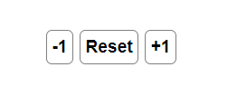
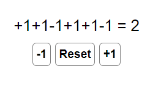

**Создание счетчика на Redux и сохраняем его состояние в Store**
* При нажатии + добавить 1
* При нажатии - добавить 1
* При нажатии "Reset" сброс
* Результат всех действий выводится строке выше

* 
* 